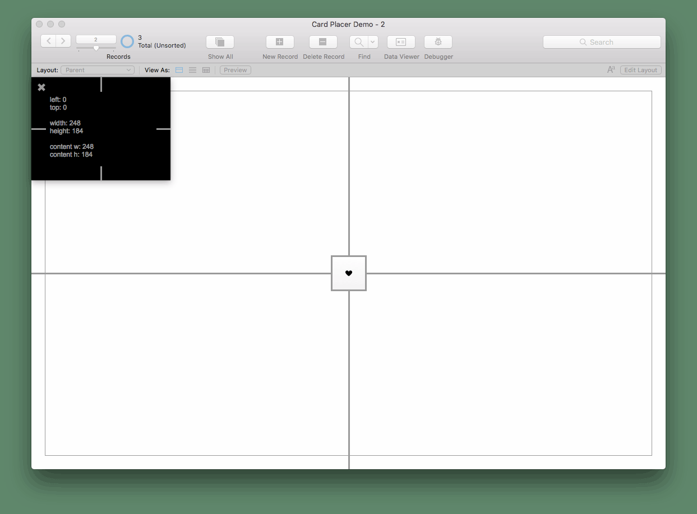

# Card Placer Module

Precisely place card windows within the parent window.

A card windows point of origin is it's parent window's top/left content area and once a card is open the parent window's size cannot be retrieved, which makes positioning card windows cumbersome.

FileMaker's `Adjust Window [Resize to Fit]` step only constrain's the card to the screen. This module will keep the card window within the content area of the parent, which is useful when a card window should allow scrolling.

This module can also assist with placing a card relative to a named layout object. This is uefull when you want a card to open directly below a button the user clicked.

As of version 2.2.0, also supports Web Direct and placing document windows.

# Status

__Released__

Ready for production use and has been used in production since 2018.

# Limitations

This module does not support the use of the "Show current record indicator in List View" layout option. Some cards may be placed 3pts off from their intended location when this feature is used.

# Preview of Tests

